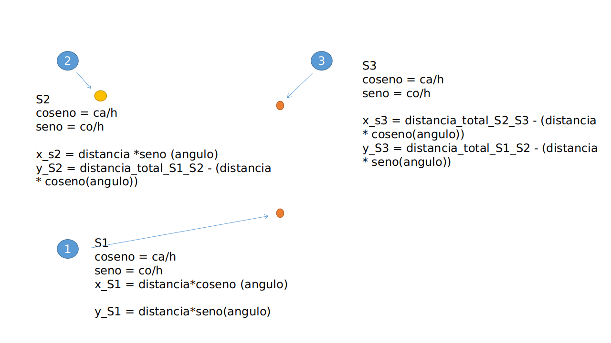

# Trabalho de TDD para a Disciplina de Desenvolvimento de Sistemas para Engenharia

Projeto baseado no modelo proposto pelo artigo presente no site Instructables (https://www.instructables.com/id/Positioning-System/), com o foco na detecção da posição de objetos através de um sensor ultrassônico junto à realização de testes automatizados.

## Funcionamento do Modelo

A presente aplicação foi desenvolvida com a linguagem Python. Seu funcionamento tem foco no processamento dos dados brutos recebidos de sensores ultrassônicos conectados à um arduino, onde o mesmo comunica-se com um computador que possui uma instância da presente aplicação ativa.

O objetivo é processar os dados brutos e retornar para o usuário a posição de cada objeto detectado.

## Cálculo do Posicionamento

Para o cálculo do posicionamento, utiliza-se dados de temperatura e tempo de resposta dos sensores. A temperatura serve como um fator de correção da velocidade do som, que se altera conforme a temperatura do meio de propagação, que neste caso,  considera-se como sendo o ar. A imagem a seguir ilustra o cálculo da posição com base na distância obtida entre cada sensor e objetos:

## Iniciando testes automatizados

Toda a documentação referente à parte de testes automatizados encontra-se no diretório "Docs". Para rodar o ambiente de testes, é necessário possuir os seguintes requisitos:

* Python 3.5 ou superior;
* Ambiente virtual (virtualenv);
* Instalar as dependências presentes no arquivo requirements.txt.

Para instalar as dependências, utilize o seguinte comando:
> pip install -r requirements.txt

Para rodar os testes, acesse o diretório raiz e utilize o comando "green Teste/" seguido do nome do arquivo referente ao código de teste. Ex:

> green Teste/TesteClasse_Posicionamento.py

Para executar todas as classes de teste, utilize o comando:

> green Teste/*

OBS: Recomenda-se o uso da IDE Pycharm para executar e manipular o código, visto que sua integração com a parte de testes automatizados é nativa e fornece os dados em uma forma simples de visualização.
